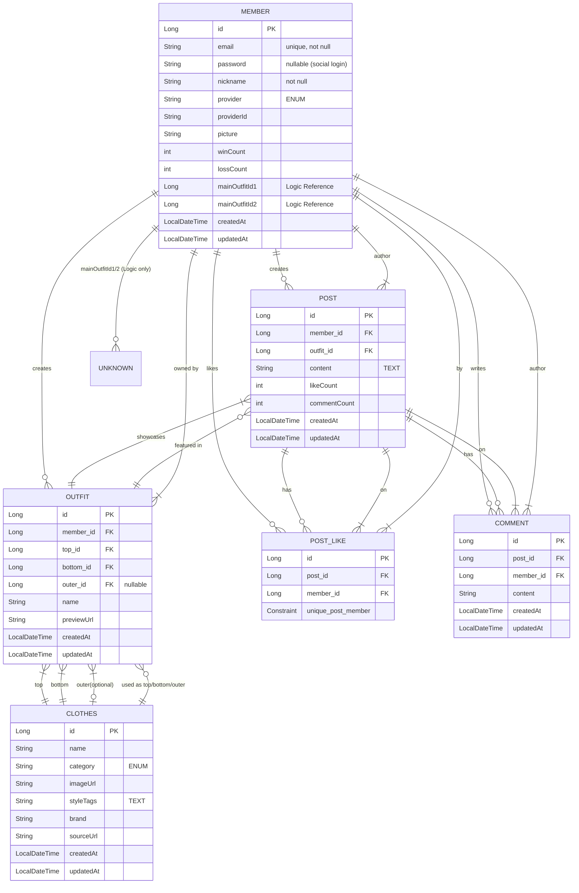

# Database Schema Documentation

This document outlines the current database schema based on the JPA Entity classes found in the application.

## Entity Relationship Diagram (ERD)

## Table Definitions

### 1. **Member** (`member`)
Stores user information including authentication details and stats.
- **id** (`Long`): Primary Key, Auto Increment.
- **email** (`String`): Unique, Not Null.
- **password** (`String`): Nullable (for social login users).
- **nickname** (`String`): Not Null.
- **provider** (`AuthProvider`): Login provider (ENUM).
- **providerId** (`String`): Provider's unique user ID.
- **picture** (`String`): Profile picture URL.
- **winCount** (`int`): Battle win count.
- **lossCount** (`int`): Battle loss count.
- **mainOutfitId1** (`Long`): ID of first main outfit (Application logic reference).
- **mainOutfitId2** (`Long`): ID of second main outfit (Application logic reference).
- **Shared Fields**: `createdAt`, `updatedAt` (`BaseTimeEntity`).

### 2. **Clothes** (`clothes`)
Catalog of individual clothing items.
- **id** (`Long`): Primary Key, Auto Increment.
- **name** (`String`): Name of the item.
- **category** (`Category`): Item category (ENUM).
- **imageUrl** (`String`): URL of the item image.
- **styleTags** (`String`): Logic-based or AI tags (Stored as TEXT).
- **brand** (`String`): Brand name.
- **sourceUrl** (`String`): Origin URL.
- **Shared Fields**: `createdAt`, `updatedAt`.

### 3. **Outfit** (`outfit`)
A collection of clothes created by a user.
- **id** (`Long`): Primary Key, Auto Increment.
- **member_id** (`Long`): Owner (FK -> Member).
- **top_id** (`Long`): Selected Top (FK -> Clothes).
- **bottom_id** (`Long`): Selected Bottom (FK -> Clothes).
- **outer_id** (`Long`): Selected Outer (FK -> Clothes, Nullable).
- **name** (`String`): Name of the outfit.
- **previewUrl** (`String`): Generated preview image URL.
- **Shared Fields**: `createdAt`, `updatedAt`.

### 4. **Post** (`post`)
Community posts showcasing an outfit.
- **id** (`Long`): Primary Key, Auto Increment.
- **member_id** (`Long`): Author (FK -> Member).
- **outfit_id** (`Long`): Featured Outfit (FK -> Outfit).
- **content** (`String`): Post content (TEXT).
- **likeCount** (`int`): Denormalized count of likes.
- **commentCount** (`int`): Denormalized count of comments.
- **Shared Fields**: `createdAt`, `updatedAt`.

### 5. **Comment** (`comment`)
Comments on posts.
- **id** (`Long`): Primary Key, Auto Increment.
- **post_id** (`Long`): Parent Post (FK -> Post).
- **member_id** (`Long`): Author (FK -> Member).
- **content** (`String`): Comment text.
- **Shared Fields**: `createdAt`, `updatedAt`.

### 6. **PostLike** (`post_like`)
Tracks likes on posts to prevent duplicate likes.
- **id** (`Long`): Primary Key, Auto Increment.
- **post_id** (`Long`): Target Post (FK -> Post).
- **member_id** (`Long`): User who liked (FK -> Member).
- **Constraints**: Unique combination of (`post_id`, `member_id`).
